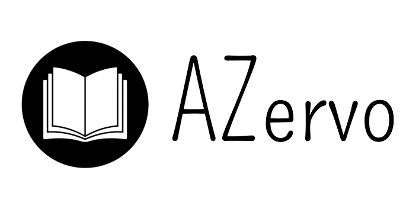

<!-- PROJECT SHIELDS -->
<!--
*** I'm using markdown "reference style" links for readability.
*** Reference links are enclosed in brackets [ ] instead of parentheses ( ).
*** See the bottom of this document for the declaration of the reference variables
*** for contributors-url, forks-url, etc. This is an optional, concise syntax you may use.
*** https://www.markdownguide.org/basic-syntax/#reference-style-links
-->
[![Contributors][contributors-shield]][contributors-url]
[![Forks][forks-shield]][forks-url]
[![Stargazers][stars-shield]][stars-url]
[![Issues][issues-shield]][issues-url]
[![MIT License][license-shield]][license-url]

<!-- PROJECT LOGO -->
 

  

  <h3 align="center">AZervo</h3>

  

    Todo conteúdo digital em um só lugar!
     
    <a href="https://github.com/matheus-delazeri/AZervo/issues">Reportar Bug</a>
    ·
    <a href="https://github.com/matheus-delazeri/AZervo/issues">Solicitar Feature</a>
  

<!-- TABLE OF CONTENTS -->

  
Sumário

  <ol>
    <li>
      <a href="#sobre-o-projeto">Sobre o Projeto</a>
      <ul>
        <li><a href="#fontes-de-documentos">Fontes de Documentos</a></li>
        <li><a href="#desenvolvido-com">Desenvolvido com</a></li>
      </ul>
    </li>
    <li><a href="#contato">Contato</a></li>
  </ol>

<!-- ABOUT THE PROJECT -->
## Sobre o Projeto

[![Product Name Screen Shot][product-screenshot]](https://example.com)

Desenvolvido por [Matheus Delazeri](https://github.com/matheus-delazeri) e [João Pedro Simão](https://github.com/jpwsimao), o projeto teve origem no ano de 2022 como um trabalho do curso de Sistemas de Informação da UFSM.

Esta aplicação tem como principal intuito facilitar a busca por documentos digitais (internacionais e nacionais) para o público brasileiro, através de uma plataforma totalmente em Pt-Br e com uma interface simples.

(<a href="#readme-top">voltar ao topo</a>)

### Fontes de Documentos

AZervo utiliza de algumas fontes de dados disponíveis na internet para disponibilzar os documentos. Sendo elas:

- [Sci-Hub](https://www.sci-hub.se/): um dos maiores fornecedores de artigos digitais;
- [Z-Library](https://z-lib.org/):  dataset que fornece uma enorme variedade de livros digitais;

Além disso, o projeto contém uma base de dados particular que armazena os documentos das fontes listadas acima, em caso dos mesmos serem removidos destas.

(<a href="#readme-top">voltar ao topo</a>)

### Desenvolvido com

A aplicação foi desenvolvida utilizando as seguintes ferramentas:

* [![PHP][PHP]][PHP-url]
* [![Bootstrap][Bootstrap.com]][Bootstrap-url]
* [![JQuery][JQuery.com]][JQuery-url]

(<a href="#readme-top">voltar ao topo</a>)

## Contato

[![Linkedin][linkedin-shield]][linkedin-matheus]

Link do Projeto: [https://github.com/matheus-delazeri/AZervo](https://github.com/matheus-delazeri/AZervo)

(<a href="#readme-top">voltar ao topo</a>)

<!-- MARKDOWN LINKS & IMAGES -->
<!-- https://www.markdownguide.org/basic-syntax/#reference-style-links -->
[contributors-shield]: https://img.shields.io/github/contributors/matheus-delazeri/AZervo.svg?style=for-the-badge
[contributors-url]: https://github.com/matheus-delazeri/AZervo/graphs/contributors
[forks-shield]: https://img.shields.io/github/forks/matheus-delazeri/AZervo.svg?style=for-the-badge
[forks-url]: https://github.com/matheus-delazeri/AZervo/network/members
[stars-shield]: https://img.shields.io/github/stars/matheus-delazeri/AZervo.svg?style=for-the-badge
[stars-url]: https://github.com/matheus-delazeri/AZervo/stargazers
[issues-shield]: https://img.shields.io/github/issues/matheus-delazeri/AZervo.svg?style=for-the-badge
[issues-url]: https://github.com/matheus-delazeri/AZervo/issues
[license-shield]: https://img.shields.io/github/license/matheus-delazeri/AZervo.svg?style=for-the-badge
[license-url]: https://github.com/matheus-delazeri/AZervo/blob/master/LICENSE.txt
[linkedin-shield]: https://img.shields.io/badge/-LinkedIn-black.svg?style=for-the-badge&logo=linkedin&colorB=555
[linkedin-matheus]: https://www.linkedin.com/in/matheus-delazeri-souza
[product-screenshot]: https://user-images.githubusercontent.com/55641441/198127860-2ee41967-3eb9-4175-bf37-273d6cfd1f9b.png
[PHP]: https://img.shields.io/badge/PHP-35495E?style=for-the-badge&logo=php&logoColor=white
[PHP-url]: https://www.php.net/
[Bootstrap.com]: https://img.shields.io/badge/Bootstrap-563D7C?style=for-the-badge&logo=bootstrap&logoColor=white
[Bootstrap-url]: https://getbootstrap.com
[JQuery.com]: https://img.shields.io/badge/jQuery-0769AD?style=for-the-badge&logo=jquery&logoColor=white
[JQuery-url]: https://jquery.com 
